# DataLens: AI-Powered Data Analysis Platform
## Technical Overview & Architecture

---

## System Overview

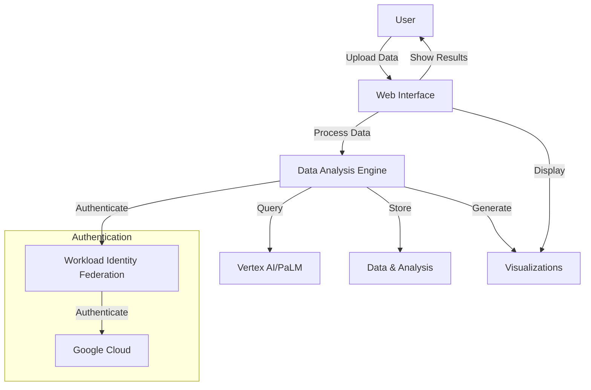

---

## Authentication Flow

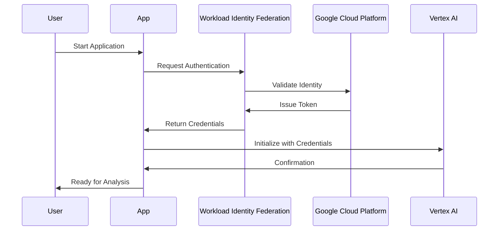

---

## Data Analysis Process

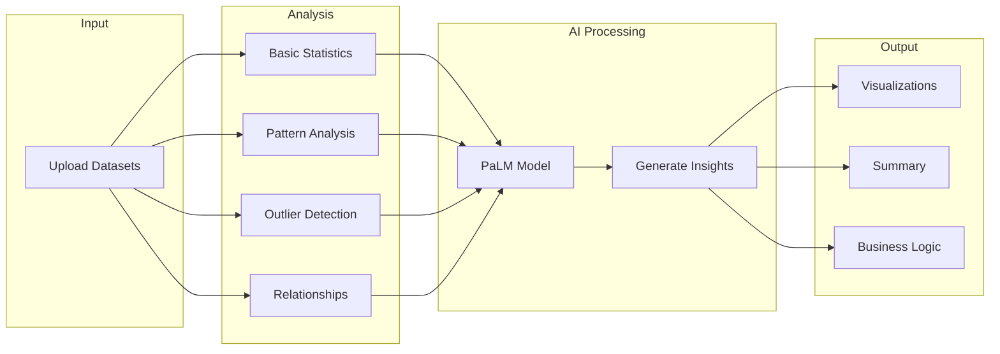

---

## Component Architecture

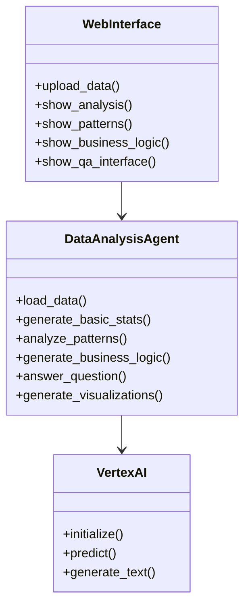

---

## Business Logic Generation Flow

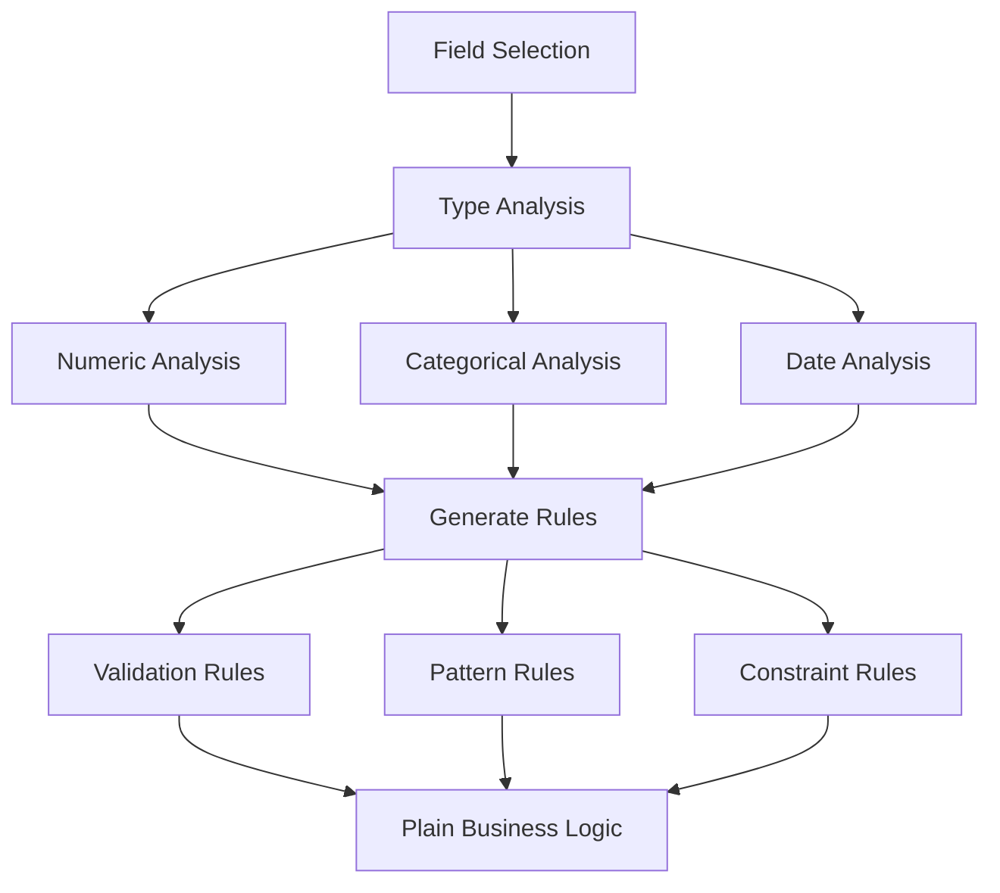

---

## User Interaction Flow

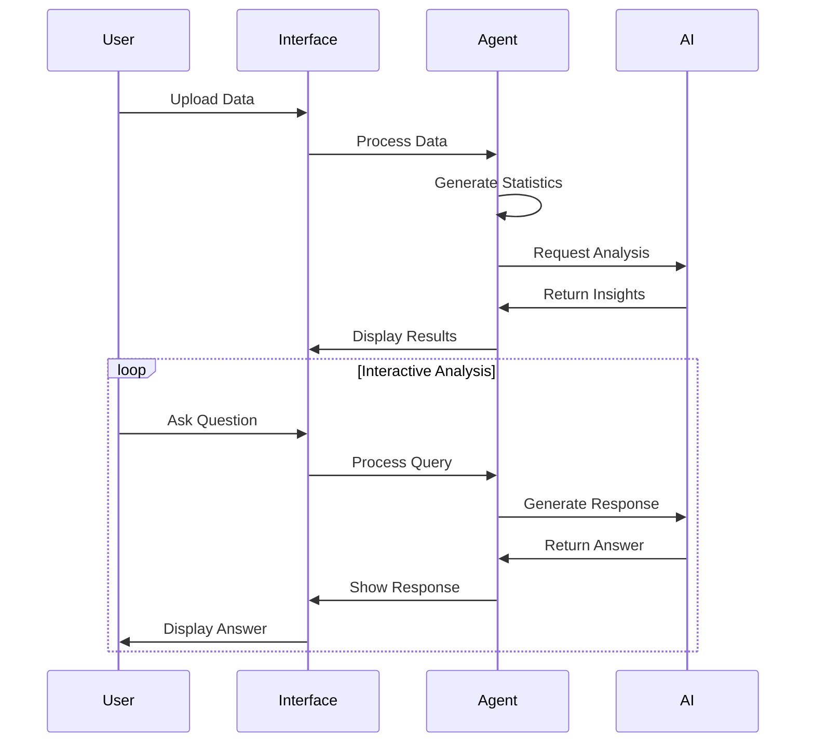

---

## Data Processing Pipeline

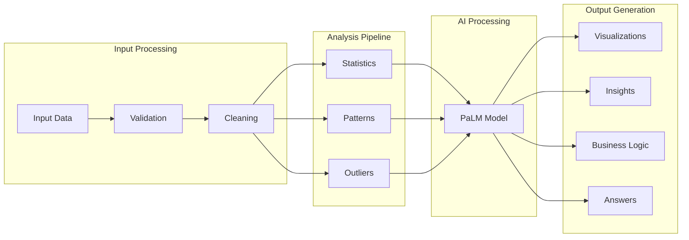

---

## Security Architecture

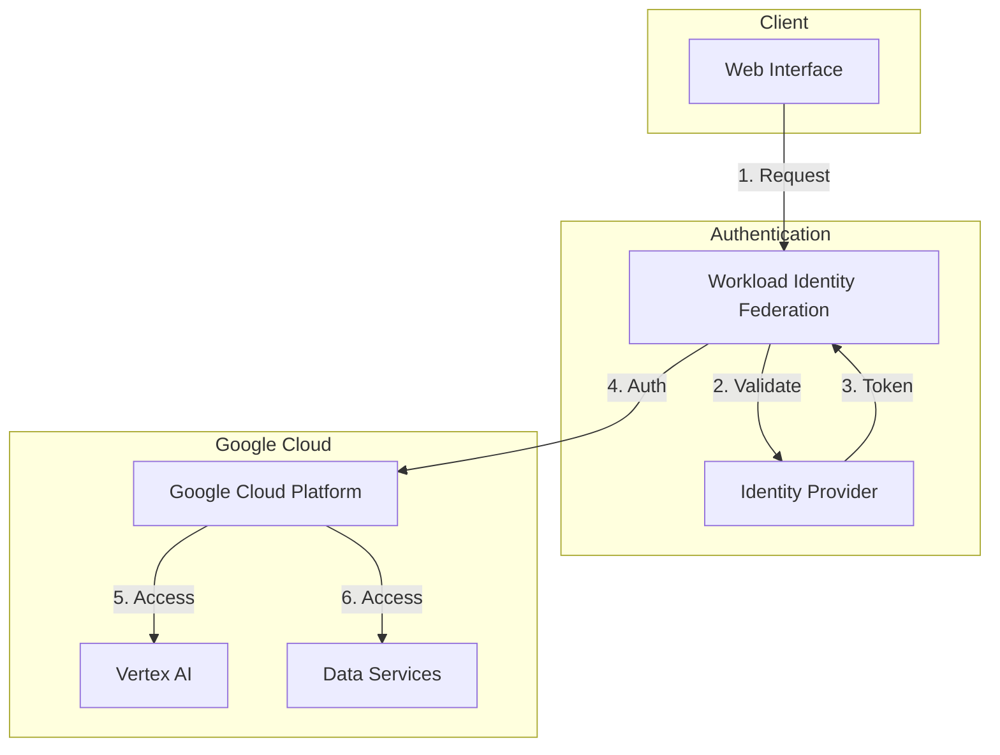

---

## Features and Capabilities

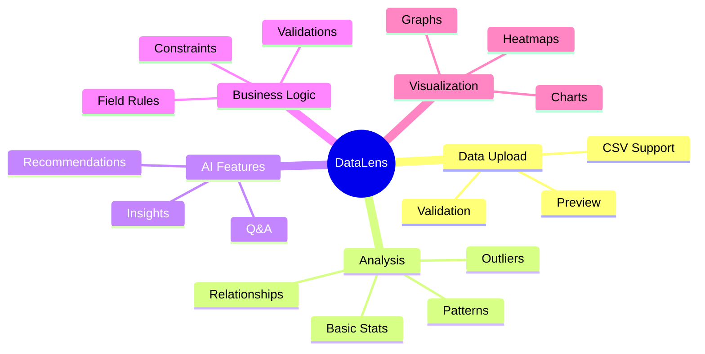

---

## Development Timeline

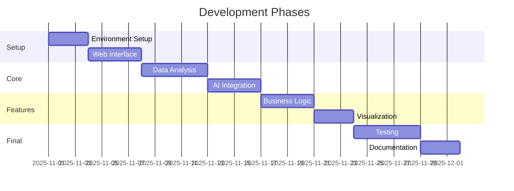

---

## Key Benefits

1. **Automated Analysis**
   - Quick insights from data
   - Consistent analysis patterns
   - Reduced manual effort

2. **AI-Powered Insights**
   - Natural language interaction
   - Context-aware responses
   - Intelligent pattern detection

3. **Business Logic Generation**
   - Automated rule creation
   - Field-specific validation
   - Clear documentation

4. **Security**
   - Workload Identity Federation
   - No stored credentials
   - Secure cloud integration

5. **Scalability**
   - Cloud-native architecture
   - Handles large datasets
   - Extensible framework

---

## Future Roadmap

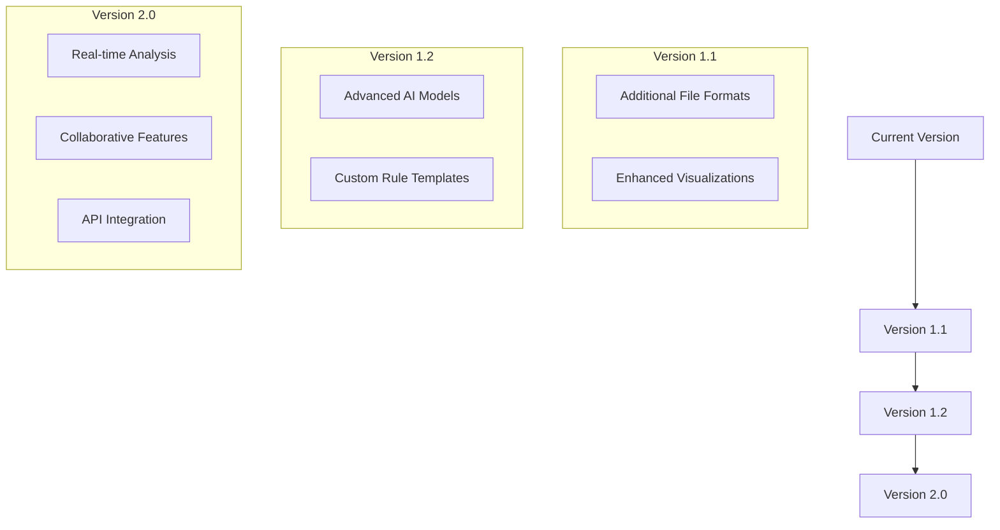
